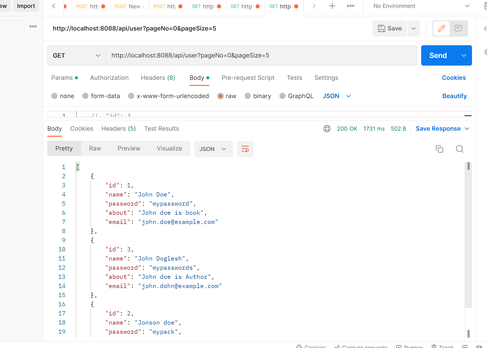

# Pagination and Sorting using Spring Boot

In this repo I am creating a complete Pagination and Sorting using Spring Boot

Paging:

In spring boot for implementing paging and sorting, we need to extend PagingAndSortingRepository in our UserRepository interface.

1. Basic project Skeleton.
2. About Rest Architecture
3. Adding different dependencies
4. Build Tools

5. Paging and Sorting Concept

While developing any spring boot API, We create many rest endpoints for the CRUD operation on data. After some time when a large number of records get inserted into DB, then fetching the records from DB takes more time, because it fetches all the records.

To overcome this problem there are multiple ways like -

We can have filters in our queries which are getting data.
We can set the limit
We can have pagination
So in this post, we will be discussing pagination and when it is required.

It is required wherever we are showing data in tabular format in UI, So instead of getting all the data in one shot and showing only 50 records is not a good idea, instead, we can use pagination in such scenarios and we can fetch relevant data quickly.

Similar way for sorting we can sort the data on the UI side also but it will be a not good idea because of performance, So we can sort it from the backend just by passing column names by which we want to sort the records.

Development using Spring Boot

Now in the development part, we will follow the below steps-

Create a spring boot project from spring initializer
Create different packages like (entity, model, repo, service, controller, config, util etc.)
Create a few crud endpoints (Like create a user, get all User).

Now for testing, we can hit this URL from the postman.

http://localhost:8088/api/user?pageNo=0&pageSize=5

Page Number starts from zero. and page Size is the number of records per page. Sometimes the user doesn't want to pass these values from the URL that's why I have added default values.

Sorting:

We can apply Paging and sorting together as well one at a time also.

The above example is about only paging. Next is paging and sorting together. the default order of sorting is descending.

PageRequest pageRequest = PageRequest.of(pageNo, pageSize, Sort.by("name").ascending());
For sorting as we have seen PagingAndSortingRepository have one findAll() method which will take Sort-Object in the argument. For sorting, we need to select by which property we want to sort our results we can select multiple properties as well. e.g.

Sort nameSort = Sort.by("name");
Sort emailSort = Sort.by("email");

Sort multiSort = emailSort.and(nameSort);

List<EmployeeEntity> result = repository.findAll(multiSort);
Slice:

Slice is similar to page only difference is while using Page it has extra data like the first page, total page, pageNumber, and count so calculating this takes extra time internally. whereas Slice is having only data and no extra info, so performance-wise it is better.

@Repository
public interface UserRepository extends CrudRepository<User, Integer> {

    public Slice<User> findByEmail(String email, Pageable pageable);
}
In Service layer Method:
Slice<User> result = userRepository.findByEmail("abcd@gmail.com", paging);
So this is all about paging and sorting using Spring Boot, It is very useful while doing projects as well as for interviews also.